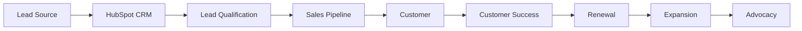
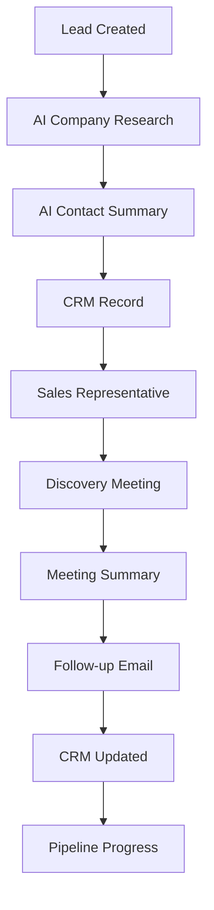

<div align="center">

# 🚀 GrowthPilot CRM

### AI-Powered CRM & Revenue Operations System for Modern Startups

Manage leads. Build relationships. Automate growth.

---


</div>

---

# Executive Summary

GrowthPilot CRM is a modern Customer Relationship Management (CRM) and Revenue Operations (RevOps) framework designed for startups, SaaS businesses, marketplaces, and B2B organizations.

The repository demonstrates how sales, marketing, customer success, and operations teams can work together using a centralized CRM ecosystem supported by AI-assisted workflows and automation.

Instead of relying on spreadsheets and disconnected communication channels, GrowthPilot CRM provides a structured system for managing customer relationships across the complete lifecycle—from lead generation to customer retention.

This project showcases practical CRM architecture, pipeline management, automation workflows, documentation, reporting, and AI-powered operational support.

---

# Business Context

As organizations scale, customer information often becomes fragmented across multiple systems.

Typical challenges include:

- Leads stored in spreadsheets
- Inconsistent follow-up processes
- Duplicate customer records
- Poor pipeline visibility
- Manual reporting
- Missed sales opportunities
- Limited collaboration between sales and marketing
- Lack of standardized CRM processes
- Delayed customer responses
- Poor lifecycle management

Without a structured CRM system, teams lose valuable time searching for information rather than building customer relationships.

GrowthPilot CRM demonstrates how modern CRM platforms and automation can centralize customer information while improving operational efficiency.

---

# Problem Statement

Many startups struggle with disconnected customer management workflows.

A common process looks like this:

```
Lead Source

↓

Excel Sheet

↓

Email

↓

WhatsApp

↓

Google Sheets

↓

Manual Follow-up

↓

Sales Call

↓

Notes

↓

Spreadsheet Update

↓

Reporting
```

This often results in:

- Lost leads
- Delayed responses
- Duplicate work
- Poor reporting
- Inaccurate pipeline forecasting
- Limited customer visibility
- Inconsistent communication
- Missed revenue opportunities

---

# Solution Overview

GrowthPilot CRM introduces a centralized CRM operating model where every customer interaction is documented, measurable, and actionable.

The framework combines CRM, automation, documentation, reporting, and AI into one scalable operating system.

Core principles include:

- Single customer view
- Standardized sales processes
- Automated workflows
- AI-assisted research
- Centralized documentation
- Pipeline visibility
- Data-driven decisions
- Cross-functional collaboration
- Continuous optimization

---

# Repository Objectives

This repository demonstrates how to build a scalable CRM system suitable for startups and growing organizations.

Primary objectives include:

- Centralize customer information
- Improve lead management
- Standardize sales processes
- Automate repetitive tasks
- Improve collaboration
- Enhance reporting
- Build reusable CRM templates
- Support revenue operations
- Improve customer lifecycle management
- Enable AI-assisted CRM workflows

---

# Core Features

## 🤝 Contact Management

Centralized customer records including:

- Leads
- Contacts
- Companies
- Accounts
- Opportunities
- Decision Makers
- Customer Notes
- Activity History

---

## 📈 Sales Pipeline

Structured sales pipeline covering:

- New Lead
- Qualified Lead
- Discovery
- Proposal
- Negotiation
- Closed Won
- Closed Lost

Every stage includes:

- Entry criteria
- Exit criteria
- Required activities
- Ownership
- KPIs

---

## 🔄 Customer Lifecycle Management

Track customers through every stage:

- Visitor
- Lead
- Marketing Qualified Lead (MQL)
- Sales Qualified Lead (SQL)
- Opportunity
- Customer
- Active Customer
- Renewal
- Expansion
- Advocacy

---

## ⚙ Workflow Automation

Automation examples include:

- Lead assignment
- Welcome emails
- Follow-up reminders
- Task creation
- Meeting scheduling
- Pipeline updates
- Notification workflows
- Contact enrichment

Designed for implementation using:

- Zapier
- Make
- HubSpot Workflows

---

## 🤖 AI-Powered CRM

AI supports operational efficiency by assisting with:

- Lead research
- Company research
- Prospect summaries
- Email drafting
- Meeting summaries
- Call preparation
- CRM note generation
- Customer segmentation
- Follow-up recommendations

Suggested AI tools:

- ChatGPT
- Claude
- Gemini
- Perplexity
- NotebookLM

---

## 📊 Reporting & Dashboards

CRM reporting includes:

- Lead volume
- Lead sources
- Pipeline value
- Win rate
- Conversion rate
- Average deal size
- Sales cycle length
- Follow-up compliance
- Customer acquisition
- Revenue forecasting

---

## 📚 CRM Knowledge Base

A centralized documentation library including:

- CRM SOPs
- Sales playbooks
- Pipeline documentation
- Automation workflows
- Customer communication templates
- AI prompt library
- Reporting standards
- Meeting documentation
- Decision logs

---

# Intended Audience

This repository is designed for:

- CRM Specialists
- Marketing Operations Teams
- Revenue Operations Professionals
- Sales Operations Teams
- Customer Success Teams
- Startup Founders
- Growth Managers
- Business Operations Professionals
- MBA Students
- Consultants

---

# Business Benefits

Implementing a structured CRM system can help organizations:

✔ Improve lead visibility

✔ Reduce manual work

✔ Standardize sales processes

✔ Improve forecasting

✔ Strengthen customer relationships

✔ Increase collaboration

✔ Improve reporting quality

✔ Reduce response times

✔ Support scalable growth

✔ Build a reusable operational framework

---

> **Note**
>
> GrowthPilot CRM is a portfolio project created to demonstrate CRM architecture, Revenue Operations concepts, workflow automation, customer lifecycle management, and AI-assisted operational processes. The workflows and documentation are intended for educational and portfolio purposes while reflecting realistic business practices.

---

# 🏗 CRM System Architecture

GrowthPilot CRM is designed using a modular architecture that separates customer data, CRM processes, automation, analytics, documentation, and AI-assisted workflows into independent yet connected business modules.

The objective is to provide a scalable CRM framework that supports sales, marketing, customer success, and operations teams throughout the customer lifecycle.

```text
                           GrowthPilot CRM

                               Users

 ┌──────────────┬──────────────┬──────────────┬──────────────┐
 │              │              │              │              │
 Marketing     Sales      Customer Success   Leadership
 │              │              │              │
 └──────────────┴──────────────┴──────────────┴──────────────┘
                             │
                             ▼
                     CRM Operations Hub
                             │
 ┌────────────┬──────────────┬──────────────┬──────────────┐
 │            │              │              │              │
HubSpot    Airtable      Notion      Google Sheets
 │            │              │              │
 └────────────┴──────────────┴──────────────┴──────────────┘
                             │
                             ▼
                     Zapier / Make
                             │
                             ▼
                     AI Assistants
ChatGPT • Claude • Gemini • NotebookLM • Perplexity
```

---

# 📂 Complete Repository Structure

```text
growthpilot-crm/

│

├── README.md

├── LICENSE

├── CHANGELOG.md

├── ROADMAP.md

├── CONTRIBUTING.md

├── CODE_OF_CONDUCT.md

├── SECURITY.md

│

├── docs/

├── hubspot/

├── airtable/

├── automation/

├── workflows/

├── dashboards/

├── templates/

├── sop/

├── ai/

├── demo/

└── assets/
```

Each directory represents one functional area of a CRM and Revenue Operations implementation.

---

# 🛠 Technology Stack

| Category | Platform | Purpose |
|----------|----------|---------|
| CRM | HubSpot | Customer relationship management and pipeline design |
| Database | Airtable | Lead, account and campaign database |
| Documentation | Notion | CRM documentation, SOPs and knowledge base |
| Automation | Zapier | Workflow automation (reference implementation) |
| Automation | Make | Multi-step CRM automation (reference implementation) |
| Productivity | Google Sheets | Data validation and reporting |
| AI | ChatGPT | Lead research, emails and CRM documentation |
| AI | Claude | Proposal writing and long-form analysis |
| AI | Gemini | Workspace productivity |
| AI | NotebookLM | Knowledge synthesis |
| AI | Perplexity | Market and company research |
| Version Control | Git & GitHub | Documentation management |

---

# 🎯 Why This Technology Stack?

Modern CRM systems extend beyond contact management.

This architecture combines documentation, CRM, structured databases, automation, reporting, and AI-assisted workflows to support scalable customer operations.

Benefits include:

- centralized customer records
- standardized sales processes
- improved collaboration
- reduced manual work
- reusable workflows
- structured reporting
- AI-assisted productivity

---

# 👥 Customer Lifecycle Architecture

Every customer progresses through clearly defined lifecycle stages.

```text
Anonymous Visitor

↓

Website Visitor

↓

Lead

↓

Marketing Qualified Lead (MQL)

↓

Sales Qualified Lead (SQL)

↓

Discovery

↓

Proposal

↓

Negotiation

↓

Customer

↓

Onboarding

↓

Adoption

↓

Renewal

↓

Expansion

↓

Advocate
```

Each lifecycle stage includes:

- ownership
- required activities
- success criteria
- KPIs
- automation opportunities

---

# 🔄 Lead-to-Revenue Workflow

```text
Lead Source

↓

CRM Capture

↓

Lead Qualification

↓

Lead Assignment

↓

Discovery Call

↓

Needs Assessment

↓

Proposal

↓

Negotiation

↓

Closed Won

↓

Customer Onboarding

↓

Customer Success

↓

Renewal

↓

Expansion
```

The workflow standardizes customer progression while improving visibility across the sales funnel.

---

# 📊 CRM Data Flow

```text
Website

↓

Forms

↓

CRM

↓

Lead Database

↓

Sales Activities

↓

Customer Interactions

↓

Pipeline Updates

↓

Reports

↓

Executive Dashboard

↓

Business Decisions
```

This flow ensures customer information is captured once and reused throughout the organization.

---

# 🤖 AI-Assisted CRM Workflow

Artificial Intelligence supports CRM processes without replacing human decision-making.

Typical AI-assisted activities include:

- prospect research
- company summaries
- CRM note generation
- follow-up email drafting
- meeting summaries
- proposal assistance
- lead prioritization
- customer segmentation
- account research
- sales preparation

Human validation is expected before customer-facing communication.

---

# 🔗 Reference Integration Architecture

The following diagram illustrates the planned interaction between platforms.

```text
                Notion
                   │
       SOPs • Documentation
        Meeting Notes • Wiki
                   │
                   ▼
               Airtable
                   │
     Leads • Companies • Tasks
      Campaigns • Activities
                   │
                   ▼
               HubSpot
                   │
 Contacts • Deals • Pipelines
 Lifecycle • Activities
                   │
                   ▼
            Zapier / Make
                   │
 Notifications • Sync
 Task Creation
 Workflow Automation
                   │
                   ▼
             Executive Reports
```

---

# 📈 Sales Pipeline Architecture

```text
New Lead

↓

Qualified

↓

Discovery

↓

Proposal

↓

Negotiation

↓

Closed Won

or

Closed Lost
```

Recommended KPIs for each stage:

- Lead Volume
- Conversion Rate
- Average Time in Stage
- Pipeline Value
- Win Rate
- Lost Reason
- Follow-up SLA

---

# 📐 CRM Architecture Diagram



---

# 📐 AI-Assisted CRM Workflow



---

# 📐 Revenue Operations Workflow

```mermaid
flowchart LR

Marketing

--> Sales

Sales

--> Customer Success

Customer Success

--> Renewals

Renewals

--> Expansion

Expansion

--> Marketing
```

---

# 🔒 CRM Design Principles

GrowthPilot CRM follows several guiding principles.

- Single source of customer truth
- Standardized lifecycle stages
- Clear ownership
- Automation where appropriate
- AI-assisted productivity
- Consistent documentation
- Reusable workflows
- Data-informed decisions
- Customer-first processes
- Continuous improvement

These principles form the foundation for every CRM workflow, SOP, automation, dashboard, and template contained within this repository.

---

# 📈 CRM KPIs & Revenue Metrics

GrowthPilot CRM is designed around measurable operational outcomes that help sales, marketing, and customer success teams make informed decisions.

## Lead Management KPIs

| KPI | Description |
|------|-------------|
| Total Leads | Number of new leads generated |
| Marketing Qualified Leads (MQLs) | Leads meeting marketing qualification criteria |
| Sales Qualified Leads (SQLs) | Leads accepted by Sales |
| Lead Response Time | Average time taken to contact a new lead |
| Lead Assignment Time | Time required to assign a lead to an owner |
| Lead Conversion Rate | Percentage of leads converted into opportunities |
| Lead Source Performance | Performance comparison across acquisition channels |

---

## Sales Pipeline KPIs

| KPI | Description |
|------|-------------|
| Pipeline Value | Total estimated revenue in pipeline |
| Number of Opportunities | Total active deals |
| Average Deal Size | Average revenue per closed opportunity |
| Win Rate | Percentage of opportunities won |
| Loss Rate | Percentage of opportunities lost |
| Average Sales Cycle | Time from lead to customer |
| Stage Conversion Rate | Conversion between pipeline stages |

---

## Customer Success KPIs

| KPI | Description |
|------|-------------|
| Customer Onboarding Completion | Percentage of successful onboardings |
| Customer Retention Rate | Active customers retained |
| Renewal Rate | Customers renewing subscriptions |
| Expansion Revenue | Revenue generated from upsells |
| Customer Satisfaction | Internal customer satisfaction score |
| Average Response Time | Customer support responsiveness |
| Customer Health Score | Overall engagement and adoption |

---

## Marketing KPIs

| KPI | Description |
|------|-------------|
| Website Traffic | Total website sessions |
| Landing Page Conversion | Visitor-to-lead conversion |
| Campaign Performance | Performance by campaign |
| Cost Per Lead (CPL) | Marketing acquisition efficiency |
| Marketing ROI | Return on marketing investment |
| Email Open Rate | Marketing email engagement |
| Email Click Rate | Engagement with campaigns |

---

## Executive Dashboard

Leadership reporting focuses on the following business metrics.

- Total Pipeline Value
- Revenue Forecast
- Monthly Qualified Leads
- Opportunity Conversion
- Customer Acquisition Cost (CAC)
- Customer Lifetime Value (LTV)
- Marketing ROI
- Sales Velocity
- Customer Retention
- Revenue Growth

---

# 💼 Expected Business Impact

GrowthPilot CRM aims to improve operational efficiency by standardizing customer relationship management across the organization.

Potential benefits include:

- Centralized customer information
- Reduced manual data entry
- Faster lead assignment
- Standardized sales process
- Improved reporting accuracy
- Better collaboration across departments
- Improved customer experience
- Better visibility into revenue pipeline
- Increased operational efficiency
- Better decision-making through structured reporting

---

# 📷 Screenshots

Screenshots will be added as each module is implemented.

## Planned Screenshots

- HubSpot Dashboard
- CRM Homepage
- Contacts
- Companies
- Deals Pipeline
- Airtable CRM
- Automation Workflow
- Notion CRM Wiki
- Executive Dashboard
- Customer Lifecycle Dashboard
- Lead Management Dashboard
- CRM Reporting Dashboard

Example directory:

```text
assets/

└── screenshots/

    ├── hubspot-home.png

    ├── contacts.png

    ├── deals-pipeline.png

    ├── airtable-crm.png

    ├── automation.png

    ├── notion-crm.png

    ├── dashboard.png

    └── executive-dashboard.png
```

---

# 🎥 Demo Guide

The project walkthrough demonstrates:

- Repository Overview
- CRM Architecture
- HubSpot Setup
- Airtable Database
- Customer Lifecycle
- Sales Pipeline
- AI-Assisted CRM
- Workflow Automation
- Reporting Dashboards
- Repository Structure

**Recommended duration:** 6–8 minutes

---

# 📚 Documentation Index

This repository includes documentation covering:

## Business Documentation

- Executive Summary
- Business Context
- CRM Strategy
- Revenue Operations
- Customer Journey
- Sales Process
- Lifecycle Design

---

## CRM Documentation

- HubSpot Setup
- Contacts
- Companies
- Deals
- Pipelines
- Lifecycle Stages
- Custom Properties
- Lists
- Workflows

---

## Automation Documentation

- Zapier Workflows
- Make Scenarios
- CRM Notifications
- Lead Routing
- Follow-up Automation
- Data Synchronization

---

## AI Documentation

- CRM Prompt Library
- Company Research
- Lead Qualification
- Email Generation
- Meeting Summaries
- Sales Preparation

---

## Operations Documentation

- SOP Library
- Templates
- Dashboard Documentation
- Reporting Standards
- Decision Logs
- CRM Governance

---

# 🛣️ Future Roadmap

## Version 1.0

- Repository Setup
- CRM Documentation
- Folder Structure
- Customer Lifecycle
- CRM Templates

---

## Version 1.1

- HubSpot CRM
- Airtable CRM Database
- Sales Pipeline
- AI Prompt Library

---

## Version 1.2

- Zapier Workflows
- Make Scenarios
- CRM Automation
- Lead Routing
- Follow-up Automation

---

## Version 1.3

- Executive Dashboard
- CRM Analytics
- Revenue Reporting
- Pipeline Forecasting

---

## Version 2.0

- AI Lead Scoring
- AI Customer Segmentation
- Public Portfolio Website
- Interactive Dashboards
- Complete Video Walkthrough
- Additional CRM Case Studies

---

# 🤝 Contributing

This repository is maintained as a portfolio project demonstrating CRM design, Revenue Operations concepts, workflow automation, documentation, and AI-assisted business processes.

Constructive feedback, suggestions, and improvements are welcome.

If you identify opportunities to improve workflows, documentation, or repository organization, please open an Issue or submit a Pull Request.

---

# 📄 License

This project is released under the MIT License.

See the **LICENSE** file for additional information.

---

# 👩‍💼 About the Author

## Chetana Rohilla

MBA — Indian Institute of Management (IIM) Rohtak

Areas of Interest

- Marketing Operations
- CRM & Revenue Operations
- Growth Strategy
- Business Operations
- Product Operations
- Customer Success
- AI Workflow Automation
- Marketing Analytics

---

## Core Skills

- HubSpot CRM
- Airtable
- Notion
- Zapier
- Make
- ChatGPT
- Claude
- CRM Design
- Sales Operations
- Marketing Operations
- Workflow Documentation
- Business Process Design

---

# 📫 Contact

### Email

chetanarohilla26@gmail.com

### LinkedIn

https://linkedin.com/in/chetana-rohilla-50ba53240

### GitHub

https://github.com/<your-github-username>

---

# ⭐ Support

If you found this repository useful or interesting:

⭐ Star the repository

🍴 Fork the project

💡 Share suggestions through GitHub Issues

🤝 Connect on LinkedIn

Feedback and discussions are always welcome.

---

<div align="center">

# 🚀 GrowthPilot CRM

### Building modern customer relationship management systems through structured documentation, CRM design, workflow automation, analytics, and AI-assisted operations.

---

**Created by Chetana Rohilla**

MBA | IIM Rohtak

Marketing Operations • Revenue Operations • CRM • AI Workflows • Business Systems

---

⭐ Thank you for visiting this repository!

</div>
